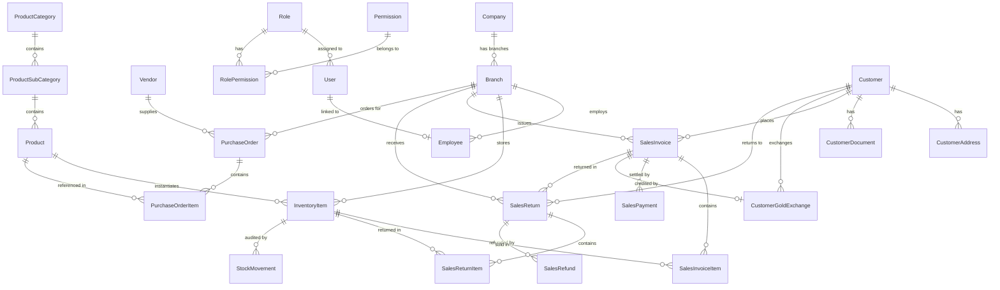

# Master System Architecture & Complete Code Flow Learning Guide

Welcome! This is the single, all-in-one comprehensive guide for understanding the entire **Jewellery Management System (JMS) Backend** codebase. It covers all phases, all sprints, architectural decisions, file responsibilities, database models, request lifecycles, and middleware execution order.

---

## 🧭 Table of Contents
1. [Architectural Overview & 5-Layer Design](#1-architectural-overview--5-layer-design)
2. [HTTP Request Lifecycle & Middleware Flow](#2-http-request-lifecycle--middleware-flow)
3. [Phase 0 — System Infrastructure (Sprints 0.1 – 0.13)](#3-phase-0--system-infrastructure-sprints-01--013)
4. [Phase 1 — Identity & Access Management (IAM) (Sprints 1.1 – 1.10)](#4-phase-1--identity--access-management-iam-sprints-11--110)
5. [Phase 2 — Master Data & Enterprise Infrastructure (Sprints 2.1 – 2.5)](#5-phase-2--master-data--enterprise-infrastructure-sprints-21--25)
6. [Phase 3 — Physical Inventory & Item Tracking (Sprints 3.1 – 3.7)](#6-phase-3--physical-inventory--item-tracking-sprints-31--37)
7. [Phase 4 — Sales, POS Billing & Financial Settlement (Sprints 4.1 – 4.6)](#7-phase-4--sales-pos-billing--financial-settlement-sprints-41--46)
8. [Database Schema Map & Relations](#8-database-schema-map--relations)
9. [Developer Learning & Code Navigation Reference](#9-developer-learning--code-navigation-reference)

---

## 1. Architectural Overview & 5-Layer Design

The application follows a clean **5-Layer Architecture** to keep concerns separated, maintainable, and testable:

```
┌─────────────────────────────────────────────────────────────────────────┐
│                           1. HTTP ROUTER LAYER                          │
│     (src/app.ts, src/modules/*/*.routes.ts - Mounts REST Endpoints)     │
└────────────────────────────────────┬────────────────────────────────────┘
                                     │
                                     ▼
┌─────────────────────────────────────────────────────────────────────────┐
│                           2. MIDDLEWARE LAYER                           │
│  (src/middleware/ - Security, Auth Token, Dynamic RBAC, Zod Validation)  │
└────────────────────────────────────┬────────────────────────────────────┘
                                     │
                                     ▼
┌─────────────────────────────────────────────────────────────────────────┐
│                           3. CONTROLLER LAYER                           │
│ (src/modules/*/*.controller.ts - Extracts Params, Calls Service, Sends) │
└────────────────────────────────────┬────────────────────────────────────┘
                                     │
                                     ▼
┌─────────────────────────────────────────────────────────────────────────┐
│                            4. SERVICE LAYER                             │
│  (src/modules/*/*.service.ts - Business Logic, Math, Prisma Transactions)│
└────────────────────────────────────┬────────────────────────────────────┘
                                     │
                                     ▼
┌─────────────────────────────────────────────────────────────────────────┐
│                           5. REPOSITORY LAYER                           │
│ (src/repositories/*.repository.ts - Prisma Query Abstraction Layer)     │
└────────────────────────────────────┬────────────────────────────────────┘
                                     │
                                     ▼
┌─────────────────────────────────────────────────────────────────────────┐
│                        POSTGRESQL DATABASE LAYER                        │
│      (Prisma Client / public & iam schemas in PostgreSQL 18 DB)         │
└─────────────────────────────────────────────────────────────────────────┘
```

---

## 2. HTTP Request Lifecycle & Middleware Flow

When a request arrives at `http://localhost:5000/api/v1/sales/invoices/INV-123/gold-exchanges`:

```
Client Request
      │
      ▼
1. Express Server (`src/server.ts` & `src/app.ts`)
      │
      ├── Security Middlewares: helmet(), cors(), compression()
      ├── Request Tracking: requestIdMiddleware (assigns req.requestId UUID)
      ├── Logging: requestLogger (logs IP, HTTP method, path)
      └── Rate Limiting: apiRateLimiter / authRateLimiter
      │
      ▼
2. Authentication (`authenticateToken` in `src/middleware/auth.middleware.ts`)
      │  - Extracts Bearer token from `Authorization` header
      │  - Verifies JWT using `config.jwt.secret`
      │  - Attaches `req.user = { id, email, roleId, roleName, permissions }`
      │
      ▼
3. Dynamic Database RBAC (`requirePermission('gold_exchange.create')` in `src/middleware/authorize.middleware.ts`)
      │  - Evaluates user role & permissions from database
      │  - Rejects unauthorized users with `403 Forbidden`
      │
      ▼
4. Request Validation (`validate({ body, params, query })` in `src/middleware/validation.middleware.ts`)
      │  - Validates request payload against Zod schema
      │  - Formats validation errors into standard `400 Bad Request`
      │
      ▼
5. Controller (`goldExchangeController.createExchange` in `src/modules/gold-exchanges/`)
      │  - Extracts `invoiceId` from `req.params` and DTO from `req.body`
      │  - Passes clean data to `goldExchangeService`
      │
      ▼
6. Business Service (`goldExchangeService.createExchange` in `src/modules/gold-exchanges/`)
      │  - Starts `prisma.$transaction()`
      │  - Validates sales invoice status is `DRAFT`
      │  - Computes Net Weight = Gross Weight - Stone Weight
      │  - Generates collision-safe `EXC-YYYY-XXXXX`
      │  - Calls `goldExchangeRepository.create()`
      │
      ▼
7. Repository (`goldExchangeRepository` in `src/repositories/`)
      │  - Invokes Prisma Client: `tx.customerGoldExchange.create({...})`
      │
      ▼
8. Response Output
      │  - Controller returns HTTP 201 Created with JSON `{ success: true, data: exchange }`
      │  - Logged by morgan request logger
```

---

## 3. Phase 0 — System Infrastructure (Sprints 0.1 – 0.13)

### Overview
Establishes the foundation of the project: Express 5 server configuration, Prisma 7 ORM integration, environment management with Zod, centralized logger, error handler, rate limiters, Swagger OpenAPI documentation, and health check endpoints.

### Key Technical Modules:
- **`src/config/env.ts`**: Zod runtime schema validating environment variables (`PORT`, `DATABASE_URL`, `JWT_SECRET`, `NODE_ENV`).
- **`src/database/index.ts`**: Prisma client initialization with PostgreSQL 18 connection pooling and shutdown hooks.
- **`src/errors/`**: Hierarchy of custom error classes (`AppError`, `BadRequestError`, `UnauthorizedError`, `ForbiddenError`, `NotFoundError`, `ConflictError`, `DatabaseError`).
- **`src/middleware/error.middleware.ts`**: Global error handling middleware formatting error payloads cleanly.
- **`src/logger/`**: Winston/Pino logger with request ID propagation and file rotation (`logs/app.log`).
- **`src/modules/health/`**: `GET /health`, `GET /health/ready`, `GET /health/live` probes checking DB connection.

---

## 4. Phase 1 — Identity & Access Management (IAM) (Sprints 1.1 – 1.10)

### Overview
Implements complete enterprise security, authentication, dynamic database-backed Role-Based Access Control (RBAC), session tracking, user management, and dynamic permission matrices.

### Database Tables (`iam` schema):
- `iam.roles`: Role definitions (`OWNER`, `ADMIN`, `MANAGER`, `CASHIER`, `SALES_EXECUTIVE`, `ACCOUNTANT`, `INVENTORY_MANAGER`, `KARIGAR`).
- `iam.permissions`: Granular permission keys (`user.create`, `user.read`, `inventory_item.read`, `sales_invoice.confirm`).
- `iam.role_permissions`: Join table linking roles to permissions.
- `iam.users`: User accounts with bcrypt password hashes and status (`ACTIVE`, `INACTIVE`, `SUSPENDED`).
- `iam.user_sessions`: Active JWT refresh tokens and session metadata.
- `iam.login_history`: Audit trail of login attempts.

### Key API Workflows:
1. **User Login (`POST /api/v1/auth/login`)**:
   - Validates email & password using bcrypt.
   - Generates JWT Access Token (short-lived) and Refresh Token (long-lived).
   - Dynamically loads active permissions for the user role and attaches `permissions: string[]` in the login payload.
2. **User Authorization (`requirePermission`)**:
   - Checks if `req.user.permissions` contains the required permission key.
   - Rejects unauthorized requests with HTTP `403 Forbidden`.

---

## 5. Phase 2 — Master Data & Enterprise Infrastructure (Sprints 2.1 – 2.5)

### Overview
Builds core business master entities required for ERP operations: enterprise multi-branch organizational hierarchy, employee profiles, customer management, vendor catalog, and product catalog taxonomy.

### 10 Core Master Tables (`public` schema):
1. `public.companies`: Root enterprise entity (GSTIN, PAN, Legal Name).
2. `public.branches`: Multi-branch showroom network (`BR-DEL-01`, `BR-GGN-02`).
3. `public.employees`: Staff records linked to Phase 1 Users.
4. `public.customers`: Retail and wholesale customer profiles (`customerCode`, mobile, email).
5. `public.customer_addresses`: Multi-address support (`HOME`, `WORK`, `BILLING`, `SHIPPING`).
6. `public.customer_documents`: KYC compliance documents (`AADHAR`, `PAN`, `PASSPORT`).
7. `public.vendors`: Supplier profiles (`vendorCode`, GSTIN, vendorType).
8. `public.product_categories`: High-level categories (`Gold`, `Silver`, `Diamond`, `Platinum`).
9. `public.product_sub_categories`: Sub-categories (`Ring`, `Chain`, `Necklace`, `Pendant`, `Bangle`).
10. `public.products`: Jewellery product master templates (`sku`, metalType, purity, weights).

---

## 6. Phase 3 — Physical Inventory & Item Tracking (Sprints 3.1 – 3.7)

### Overview
Manages unique physical jewellery items, tag generation (Barcodes & QR codes), stock movements, inter-branch stock transfers, and high-resolution image attachments.

### Core Inventory Entities:
- `InventoryItem`: Unique physical jewellery item (`itemCode`, grossWeight, netWeight, stoneWeight, purity, status: `AVAILABLE`, `RESERVED`, `SOLD`, `TRANSFERRED`).
- `StockMovement`: Immutable audit log tracking every inventory event (`STOCK_IN`, `SALE`, `TRANSFER`, `ADJUSTMENT`).
- `InventoryTag`: Barcode (`BC-<itemCode>`) and QR code (`QR-<itemCode>`) tag mapping.
- `InventoryTransfer`: 6-stage inter-branch stock transfer workflow (`REQUESTED` $\rightarrow$ `APPROVED` $\rightarrow$ `DISPATCHED` $\rightarrow$ `RECEIVED`).

---

## 7. Phase 4 — Sales, POS Billing & Financial Settlement (Sprints 4.1 – 4.7)

### Overview
The complete billing engine covering sales invoices, metal market rate locking, POS billing with atomic stock deduction, making charges, wastage, GST calculation, multi-method payment settlements, old-gold exchange credits, and sales returns/refunds.

### Sprint Breakdown:
- **Sprint 4.1 — Sales Invoice Foundation**: `SalesInvoice` & `SalesInvoiceItem` models, state machine (`DRAFT` $\rightarrow$ `CONFIRMED` / `CANCELLED`), sequential invoice numbers (`INV-BR-DEL-01-2026-00001`).
- **Sprint 4.2 — Metal Rate Engine & Lock**: Daily market rate management (`MetalRate`), overlap validation, current rate lookup, and immutable invoice rate locking (`SalesInvoiceMetalRate`).
- **Sprint 4.3 — POS Billing & Stock Deduction**: Atomic confirmation transition (`DRAFT` $\rightarrow$ `CONFIRMED`), status update (`AVAILABLE` $\rightarrow$ `SOLD`), and `SALE` `StockMovement` creation inside single `prisma.$transaction()`.
- **Sprint 4.4 — Making Charges, Wastage & GST Engine**: Making charge types (`PER_GRAM`, `FIXED`, `PERCENTAGE`), line-item pricing formula ($\text{Item Total} = \text{Metal Value} + \text{Wastage Value} + \text{Making Charges} + \text{Tax Amount}$), CGST+SGST (`INTRA_STATE`) vs IGST (`INTER_STATE`), stored pricing snapshots.
- **Sprint 4.5 — Payment Processing & Settlement**: Multi-method payments (`CASH`, `CARD`, `UPI`, `BANK_TRANSFER`, `CHEQUE`), overpayment protection (409 Conflict), settlement tracking (`totalPaid`, `outstandingAmount`, `paymentStatus`), and audit reversals.
- **Sprint 4.6 — Customer Gold Exchange**: Old gold valuation against DRAFT invoices (`REQUESTED` $\rightarrow$ `VALUED` $\rightarrow$ `APPLIED` / `CANCELLED`), rate snapshotting, deduction percent, additive `exchangeCredit` on `SalesInvoice`, and settlement integration ($\text{Net Payable} = \text{Grand Total} - \text{Exchange Credit}$).
- **Sprint 4.7 — Sales Returns & Refunds**: Return lifecycle for confirmed invoices (`REQUESTED` $\rightarrow$ `APPROVED` $\rightarrow$ `PROCESSED`), atomic inventory restoration (`SOLD` $\rightarrow$ `AVAILABLE`), `SALE_RETURN` `StockMovement` audit logs, separate `SalesRefund` ledger (`REF-YYYY-XXXXX`) without altering historical payment records, and refund reversals.

---

## 8. Phase 5 — Inventory Operations & Procurement (Sprints 5.1 – 5.8)

- **Sprint 5.1 — Purchase Foundation**: Purchase Order foundation models (`PurchaseOrder`, `PurchaseOrderItem`), sequential concurrency-safe order numbering (`PO-YYYYMMDD-XXXX`), status lifecycle (`DRAFT` $\rightarrow$ `SUBMITTED` $\rightarrow$ `APPROVED` / `CANCELLED`), strict edit locking, authoritative server-side Decimal price and GST calculations, dynamic RBAC (`purchase.create`, `purchase.read`, `purchase.update`, `purchase.submit`, `purchase.approve`, `purchase.cancel`), and 22/22 automated integration tests.
- **Sprint 5.2 — Purchase Order Receiving & Intake**: Physical receiving intake (`PurchaseReceipt`, `PurchaseReceiptItem`), barcode tag generation, automatic inventory item intake (`InventoryItem`), stock movement audit ledger (`StockMovement`), status progression (`APPROVED` $\rightarrow$ `RECEIVING` $\rightarrow$ `COMPLETED`).
- **Sprint 5.3 — Purchase Billing, Costing & Vendor Payable Foundation**: Financial bill recording (`PurchaseBill`, `PurchaseBillItem`), sequential bill numbering (`PB-YYYYMMDD-XXXX`), status lifecycle (`DRAFT` $\rightarrow$ `SUBMITTED` $\rightarrow$ `APPROVED` / `CANCELLED`), billable quantity engine preventing over-billing against physical receipts, dynamic RBAC (`purchase_bill.*`), 29/29 automated integration tests. (Frontend NOT implemented, Vendor payments NOT implemented).
- **Sprint 5.4 — Vendor Payment & Payable Settlement**: Vendor payment recording (`VendorPayment`), sequential payment numbering (`VPAY-YYYY-XXXXX`), payment methods (`CASH`, `CARD`, `UPI`, `BANK_TRANSFER`, `CHEQUE`), atomic bill balance updates (`totalPaid`, `outstandingAmount`), status progression (`APPROVED` $\rightarrow$ `PARTIALLY_PAID` $\rightarrow$ `PAID`), immutable ledger reversal workflow (`vendor_payment.reverse`), vendor payable summary aggregations, overpayment protection (409 Conflict), dynamic RBAC (`vendor_payment.*`), 40/40 automated integration tests. (Frontend NOT implemented, External payment gateway NOT implemented).
- **Sprint 5.5 — Purchase Return & Vendor Debit Note Management**: Purchase return recording (`PurchaseReturn`, `PurchaseReturnItem`), sequential return numbering (`PR-YYYYMMDD-XXXX`), status progression (`DRAFT` $\rightarrow$ `SUBMITTED` $\rightarrow$ `APPROVED` $\rightarrow$ `PROCESSED`), inventory stock removal (`RETURNED_TO_VENDOR`), `PURCHASE_RETURN` `StockMovement` audit logs, Vendor Debit Note generation (`DN-YYYY-XXXXX`), Purchase Bill balance adjustment, dynamic RBAC (`purchase_return.*`, `debit_note.read`), 30/30 automated integration tests. (Frontend NOT implemented).
- **Sprint 5.6 — Karigar / Artisan Job Work & Material Issue Management**: Job work order tracking (`JobWorkOrder`, `JobWorkMaterialIssue`, `JobWorkReceipt`), sequential order numbering (`JW-YYYYMMDD-XXXX`), material issuance (`RAW_METAL`, `LOOSE_STONE`, `INVENTORY_ITEM`), stock status update (`ISSUED_TO_KARIGAR`), `ISSUED_TO_KARIGAR` and `KARIGAR_RECEIVING` `StockMovement` logs, finished goods tag generation (`AVAILABLE`), wastage & labor making charge engine, Karigar metal & financial ledger summary, dynamic RBAC (`job_work.*`), 27/27 automated integration tests. (Frontend NOT implemented).
- **Sprint 5.7 — Stock Audit, Stocktake & Inventory Reconciliation**: Stock audit tracking (`StockAuditSession`, `StockAuditItem`), sequential audit numbering (`AUD-YYYYMMDD-XXXX`), expected inventory snapshotting, physical barcode/RFID scanning (`MATCHED`, `UNEXPECTED`, `WEIGHT_MISMATCH`), automatic missing item detection (`MISSING`), reconciliation engine (`AUDIT_MISSING` status, `STOCKTAKE_MISSING` `StockMovement` logs, `StockAdjustment` records), audit discrepancy reporting, dynamic RBAC (`stock_audit.*`), 26/26 automated integration tests. (Frontend NOT implemented).

---

## 9. Database Schema Map & Relations



---

## 10. Developer Learning & Code Navigation Reference

### Folder Structure Summary:
- **`src/app.ts`**: Express application setup, security middleware mounting, router registrations, global error middleware.
- **`src/server.ts`**: HTTP server entrypoint listening on `PORT` 5000.
- **`src/config/`**: Configuration objects and Zod environment validator.
- **`src/database/`**: Prisma Client instance export (`prisma`) and DB helper functions.
- **`src/middleware/`**: `auth.middleware.ts`, `authorize.middleware.ts`, `validation.middleware.ts`, `error.middleware.ts`, `logger.middleware.ts`.
- **`src/modules/`**: Modular domain features (e.g. `auth/`, `users/`, `roles/`, `inventory/`, `sales-invoices/`, `metal-rates/`, `pricing/`, `sales-payments/`, `gold-exchanges/`).
- **`src/repositories/`**: Clean Prisma database abstraction layer isolating query logic from HTTP controllers.
- **`prisma/schema.prisma`**: Single source of truth for PostgreSQL database tables, enums, indices, and relations.
- **`prisma/seed.ts`**: Automated database seeder importing domain seeders from `prisma/seed/*.ts`.
- **`test/`**: Integration test suites testing API endpoints end-to-end using Node.js `assert` and Express server runner.

Happy Coding & Learning! 🚀
