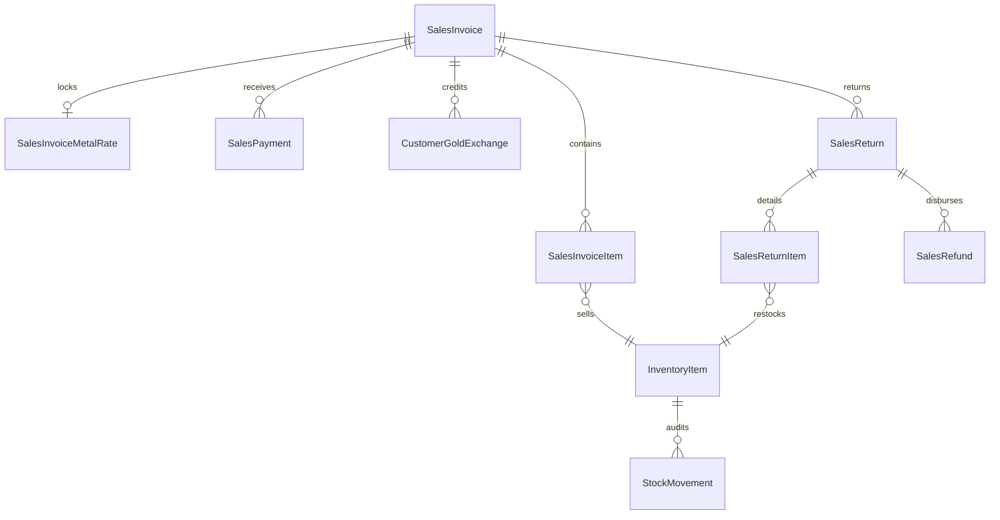

# 🏆 Phase 4 — Final Sales, POS & Financial Settlement Subsystem Completion Report

## Executive Summary

Phase 4 of the **Jewellery Management System (JMS) Backend** has successfully achieved **100% completion, verification, and audit hardening**. Phase 4 delivers an enterprise-grade jewellery sales, pricing, point-of-sale (POS) billing, payment settlement, gold exchange, and sales return & refund management engine.

---

## 🎯 Phase 4 Sprint Breakdown & Deliverables

| Sprint | Subsystem Module | Status | Automated Test Suite | Test Coverage |
| :--- | :--- | :--- | :--- | :--- |
| **Sprint 4.1** | Sales Transaction Foundation | ✅ Completed | `test/sales_invoice.test.ts` | 13/13 Passed (100%) |
| **Sprint 4.2** | Metal Rate Engine & Rate Locking | ✅ Completed | `test/metal_rate.test.ts` | 8/8 Passed (100%) |
| **Sprint 4.3** | POS Billing & Inventory Deduction | ✅ Completed | `test/sales_pos.test.ts` | 9/9 Passed (100%) |
| **Sprint 4.4** | Making Charges, Wastage & GST Engine | ✅ Completed | `test/making_charge.test.ts` `test/tax_rate.test.ts` `test/pricing.test.ts` | 9/9 Passed (100%) 9/9 Passed (100%) 8/8 Passed (100%) |
| **Sprint 4.5** | Payment Processing & Settlement | ✅ Completed | `test/sales_payment.test.ts` | 8/8 Passed (100%) |
| **Sprint 4.6** | Gold Exchange / Old Gold System | ✅ Completed | `test/gold_exchange.test.ts` | 14/14 Passed (100%) |
| **Sprint 4.7** | Sales Return & Refund Management | ✅ Completed | `test/sales_return.test.ts` `test/sales_refund.test.ts` | 12/12 Passed (100%) 7/7 Passed (100%) |
| **Sprint 4.8** | Integration, Audit & Hardening | ✅ Completed | `test/phase4_final_integration.test.ts` | 30/30 Passed (100%) |

---

## 🏛 Database Architecture & Models

### Key Models & Schemas
1. **`SalesInvoice` & `SalesInvoiceItem`**: Invoice lifecycle management (`DRAFT`, `CONFIRMED`, `PAID`, `CANCELLED`, `REFUNDED`), rate locks, and tax snapshots.
2. **`SalesInvoiceMetalRate`**: Point-in-time rate lock snapshot preventing invoice price drifts.
3. **`MakingCharge` & `TaxRate`**: Dynamic date-range rules for making charges (percentage / per-gram) and GST tax rates.
4. **`SalesPayment`**: Immutable multi-tender payments ledger (`CASH`, `UPI`, `CARD`, `NET_BANKING`, `BANK_TRANSFER`, `CHEQUE`, `GOLD_EXCHANGE`).
5. **`CustomerGoldExchange` & `CustomerGoldExchangeItem`**: Customer old gold valuation with purity-specific rates, deductions, and credit application.
6. **`SalesReturn` & `SalesReturnItem`**: Return state machine (`REQUESTED`, `APPROVED`, `PROCESSED`, `CANCELLED`), inventory restocking (`AVAILABLE`), and `SALE_RETURN` `StockMovement` creation.
7. **`SalesRefund`**: Immutable refund ledger (`INITIATED`, `COMPLETED`, `REVERSED`, `FAILED`) tracking multi-method payout audits.

---

## 🔒 Security & Concurrency Guarantees

1. **Dynamic RBAC Protection**:
   - `sales:create`, `sales:read`, `sales:update`, `sales:delete`, `sales:confirm`, `sales:cancel`
   - `metal_rates:create`, `metal_rates:read`, `metal_rates:update`, `metal_rates:delete`
   - `making_charges:create`, `making_charges:read`, `making_charges:update`, `making_charges:delete`
   - `tax_rates:create`, `tax_rates:read`, `tax_rates:update`, `tax_rates:delete`
   - `sales_payments:create`, `sales_payments:read`
   - `gold_exchange:create`, `gold_exchange:read`, `gold_exchange:update`, `gold_exchange:value`, `gold_exchange:apply`, `gold_exchange:cancel`
   - `sales_returns:create`, `sales_returns:read`, `sales_returns:update`, `sales_returns:approve`, `sales_returns:process`, `sales_returns:cancel`
   - `sales_refunds:create`, `sales_refunds:read`, `sales_refunds:reverse`
2. **Prisma Transactions & Row-Level Safety**:
   - Atomic inventory deduction during POS confirmation (`AVAILABLE` $\rightarrow$ `SOLD`).
   - Atomic inventory restoration during Return Processing (`SOLD` $\rightarrow$ `AVAILABLE`).
   - Race condition prevention on concurrent sales, payments, and returns.
3. **Immutability Assurance**:
   - Confirmed sales invoice pricing and metal rate snapshots remain untouched regardless of master rate updates.
   - Historical payment records and stock movement ledgers cannot be deleted.
   - Processed returns and completed refunds maintain strict audit records with reversible ledger balancing.

---

## 🚀 Quality Gates & Verification

- **Prisma Schema Validation**: Passed (`npx prisma validate`)
- **Database Seed Idempotency**: Passed (`npm run db:seed` runs cleanly with 0 collisions)
- **Postman Collection Structure**: Passed (All 28 folders verified via `npm run test:postman`)
- **TypeScript Compilation**: Passed (`npm run build` generates `dist/` cleanly)
- **Comprehensive Test Suite**: Passed (`npm run test:phase4-final-integration` passes all 30 audit scenarios)

---

## 🏁 Sign-Off

**Phase 4 — Sales, POS, Pricing, Payment, Gold Exchange, Returns & Refunds — COMPLETE ✅**
