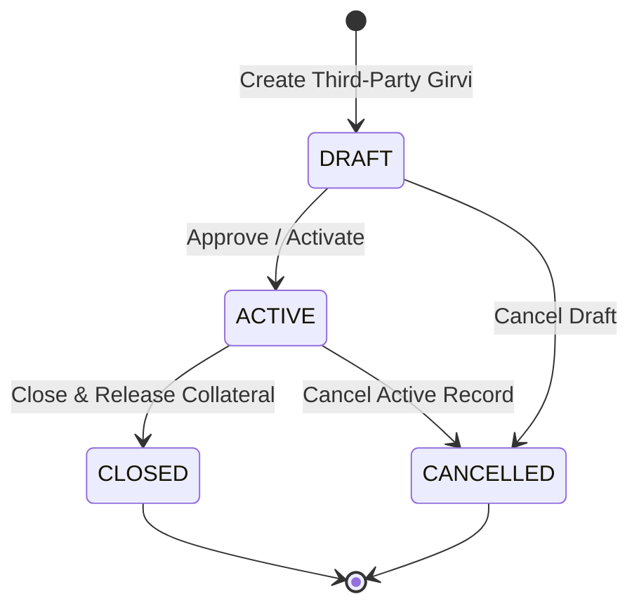

# 📘 Phase 6 — Sprint 6.4: Third-Party Girvi Management Subsystem

## 1. Overview & Business Purpose

**Third-Party Girvi** manages collateral loans where an external financier/lender (such as Muthoot Finance, Manappuram Gold Loan, or a private financier) lends money directly to the customer, while JMS/store records and tracks the pledge relationship and collateral details.

### Key Distinction:
* **Self Girvi (6.1–6.3)**: JMS is the direct lender. Loan principal is paid out from store cash/bank accounts, and collected interest/settlements are received directly into JMS accounts.
* **Third-Party Girvi (6.4)**: An external entity provides the loan. **Third-party Girvi loans and payments are strictly separated from JMS internal financials** and do NOT affect store receivables, payables, or Self Girvi outstanding balances.

---

## 2. Domain Models & Schema Design

### `ThirdPartyLender`
Represents an external financial institution or private financier.
* `id`: UUID (Primary Key)
* `companyId`: UUID (Multi-tenant isolation)
* `branchId`: UUID (Optional branch association)
* `lenderCode`: String (Unique per company, e.g. `LDR-0001`)
* `name`: String (e.g., `Muthoot Finance`)
* `contactPerson`, `mobile`, `email`, `address`
* `isActive`: Boolean

### `ThirdPartyGirvi`
Tracks external loan agreements and collateral snapshots.
* `id`: UUID (Primary Key)
* `referenceNumber`: String (Unique JMS tracking reference, e.g., `TPG-20260821-0001`)
* `externalLoanNumber`: String (Lender's loan account number, unique per lender)
* `companyId`, `branchId`, `customerId`, `thirdPartyLenderId`
* `loanDate`, `dueDate`
* `principalAmount`, `valuationAmount`, `interestRate`, `interestPeriod`
* `status`: `DRAFT` $\rightarrow$ `ACTIVE` $\rightarrow$ `CLOSED` (or `CANCELLED`)
* `notes`, `documentRef`
* Audit fields: `createdBy`, `approvedBy`, `closedBy`, `cancelledBy`

### `ThirdPartyGirviCollateral`
* `id`: UUID (Primary Key)
* `thirdPartyGirviId`: UUID (FK to `ThirdPartyGirvi`)
* `inventoryItemId`: UUID (Optional link to store inventory)
* `itemName`, `metalType`, `purity`, `grossWeight`, `stoneWeight`, `netWeight`, `valuedAmount`
* `isReleased`: Boolean (default `false`)
* `releasedAt`: DateTime?

---

## 3. Lifecycle State Machine

---

## 4. API Endpoints Reference

| Method | Endpoint Path | Permission | Description |
| :--- | :--- | :--- | :--- |
| `POST` | `/api/v1/girvi/third-party/lenders` | `third_party_girvi.create` | Create a Third-Party Lender |
| `GET` | `/api/v1/girvi/third-party/lenders` | `third_party_girvi.read` | List active lenders |
| `POST` | `/api/v1/girvi/third-party/loans` | `third_party_girvi.create` | Create a Third-Party Girvi record |
| `GET` | `/api/v1/girvi/third-party/loans` | `third_party_girvi.read` | List paginated Third-Party Girvi records |
| `GET` | `/api/v1/girvi/third-party/loans/:id` | `third_party_girvi.read` | Get Third-Party Girvi details by ID |
| `PUT` | `/api/v1/girvi/third-party/loans/:id` | `third_party_girvi.update` | Update draft record details |
| `POST` | `/api/v1/girvi/third-party/loans/:id/approve` | `third_party_girvi.approve` | Approve and activate record |
| `POST` | `/api/v1/girvi/third-party/loans/:id/close` | `third_party_girvi.close` | Close record and release collateral |
| `POST` | `/api/v1/girvi/third-party/loans/:id/cancel` | `third_party_girvi.cancel` | Cancel record with reason |
| `POST` | `/api/v1/girvi/third-party/loans/:id/collaterals` | `third_party_girvi.update` | Add collateral item to record |
| `POST` | `/api/v1/girvi/third-party/collaterals/:collateralId/release` | `third_party_girvi.release` | Release specific collateral item |

---

## 5. Security & RBAC Matrix

* `third_party_girvi.create`: Assigned to `OWNER`, `SUPER_ADMIN`, `ADMIN`, `BRANCH_MANAGER`, `ACCOUNTANT`
* `third_party_girvi.read`: Assigned to `OWNER`, `SUPER_ADMIN`, `ADMIN`, `BRANCH_MANAGER`, `ACCOUNTANT`, `SALES_EXECUTIVE`
* `third_party_girvi.update`: Assigned to `OWNER`, `SUPER_ADMIN`, `ADMIN`, `BRANCH_MANAGER`, `ACCOUNTANT`
* `third_party_girvi.approve`: Assigned to `OWNER`, `SUPER_ADMIN`, `ADMIN`, `BRANCH_MANAGER`, `ACCOUNTANT`
* `third_party_girvi.close`: Assigned to `OWNER`, `SUPER_ADMIN`, `ADMIN`, `BRANCH_MANAGER`, `ACCOUNTANT`
* `third_party_girvi.cancel`: Assigned to `OWNER`, `SUPER_ADMIN`, `ADMIN`, `BRANCH_MANAGER`, `ACCOUNTANT`
* `third_party_girvi.release`: Assigned to `OWNER`, `SUPER_ADMIN`, `ADMIN`, `BRANCH_MANAGER`, `ACCOUNTANT`, `SALES_EXECUTIVE`
