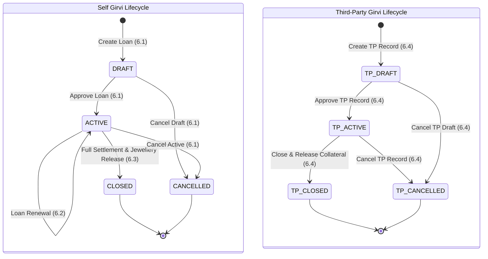

# 📘 Phase 6 — Sprint 6.5: Girvi Reports & Final Integration Backend

## 1. Overview & Objectives

Phase 6.5 is the final backend sprint for Phase 6 (Girvi & Pawning Subsystem).
It delivers a unified, read-only Girvi reporting and integration layer covering:
1. **Self Girvi Loan Management** (Phase 6.1)
2. **Interest Engine & Collections** (Phase 6.2)
3. **Loan Renewals** (Phase 6.2)
4. **Loan Settlements & Collateral Jewellery Release** (Phase 6.3)
5. **Third-Party Girvi Management** (Phase 6.4)
6. **Self Girvi Collateral Items** (Phase 6.1)
7. **Girvi Inventory Movements & Stock Tracking** (Phase 6.3/6.4)
8. **360-Degree Chronological Audit Trail & Activity Logging** (Phase 6.5)

### Core Financial Rules & Safety Enforced:
* **Read-Only Operations**: All reporting and audit APIs are strictly read-only and generate zero database mutations.
* **Self Girvi vs. Third-Party Isolation**: Financial metrics (issued principal, outstanding, interest, collections, settlements) for Self Girvi and Third-Party Girvi remain strictly separated. Third-party principal and valuation figures are tracked independently.
* **Multi-Tenant Isolation**: All queries respect `companyId` and `branchId` tenant boundaries.
* **RBAC Compliance**: Secured with `girvi.report.read` and standard Phase 6 permissions.

---

## 2. Comprehensive Report Catalog

### Report 1: Girvi Dashboard Summary
* **Endpoint**: `GET /api/v1/girvi/reports/portfolio`
* **Metrics Returned**:
  * Total Self Girvi loan count, active loan count, closed loan count
  * Total principal issued, principal outstanding, accrued interest, interest collected, interest outstanding, total portfolio outstanding
  * Third-Party Girvi counts and financial metrics reported separately.

### Report 2: Self Girvi Loan Report
* **Endpoint**: `GET /api/v1/girvi/loans`
* **Supported Filters**: `companyId`, `branchId`, `customerId`, `status`, `fromDate`, `toDate`, `dueStartDate`, `dueEndDate`, `overdue`, `renewed`
* **Fields Returned**: Loan number, customer, principal, valuation, interest rate, due date, status, outstanding, overdue days, collateral count.

### Report 3: Collection Report
* **Endpoint**: `GET /api/v1/girvi/collections`
* **Supported Filters**: `companyId`, `branchId`, `customerId`, `girviLoanId`, `paymentMethod`, `status`, `fromDate`, `toDate`
* **Fields Returned**: Collection number, loan number, customer details, payment method, collection amount, principal component, interest component, collection date, status (`COMPLETED` / `REVERSED`), transaction reference. Historical reversed collections remain fully visible.

### Report 4: Overdue & Aging Analysis Report
* **Endpoint**: `GET /api/v1/girvi/reports/overdue-aging` & `GET /api/v1/girvi/overdue-loans`
* **Supported Filters**: `companyId`, `branchId`, `daysThreshold`
* **Buckets Returned**: Current, 1–30 Days Overdue, 31–60 Days Overdue, 61–90 Days Overdue, 90+ Days Overdue.

### Report 5: Loan Renewal Report
* **Endpoint**: `GET /api/v1/girvi/loans/:id/audit-trail` (filtered by `LOAN_RENEWED` events)
* **Fields Returned**: Loan number, previous due date, new due date, accrued interest at renewal, principal at renewal, interest paid at renewal, renewed by user ID, renewal timestamp.

### Report 6: Settlement & Release Report
* **Endpoint**: `GET /api/v1/girvi/settlements`
* **Supported Filters**: `companyId`, `branchId`, `girviLoanId`, `paymentMethod`, `fromDate`, `toDate`
* **Fields Returned**: Settlement number, loan number, customer details, settlement amount, principal settled, interest settled, settlement date, payment method, settled by user ID, released collateral count.

### Report 7: Collateral Report
* **Endpoint**: `GET /api/v1/girvi/loans/:id/released-collateral` & `GET /api/v1/girvi/loans/:id`
* **Fields Returned**: Loan number, customer, item name, metal type, purity, gross/net/stone weight, valuation amount, barcode, RFID EPC, release status (`PLEDGED` / `RELEASED`), release timestamp.

### Report 8: Third-Party Girvi Report
* **Endpoint**: `GET /api/v1/girvi/third-party/loans`
* **Supported Filters**: `companyId`, `branchId`, `thirdPartyLenderId`, `status`, `fromDate`, `toDate`
* **Fields Returned**: JMS reference number, external loan number, lender details, customer details, principal, valuation, interest rate, loan date, due date, status, collateral count.

### Report 9: 360-Degree Chronological Audit Trail
* **Endpoint**: `GET /api/v1/girvi/loans/:id/audit-trail`
* **Events Tracked**: Loan Creation, Approval, Interest Collections, Collection Reversals, Loan Renewals, Full Settlements, Collateral Jewellery Release, Loan Cancellation.

---

## 3. End-to-End Phase 6 Integration Lifecycle

---

## 4. Quality Gates & Test Suite Verification

| Test Suite Script | Command | Result |
| :--- | :--- | :--- |
| Self Girvi Foundation | `npm run test:girvi` | ✅ PASSED |
| Interest & Collections Engine | `npm run test:girvi-interest-collection` | ✅ PASSED |
| Settlement & Jewellery Release | `npm run test:girvi-settlement` | ✅ PASSED |
| Third-Party Girvi Subsystem | `npm run test:third-party-girvi` | ✅ PASSED |
| Reports & Audit Trail | `npm run test:girvi-reports` | ✅ PASSED |
| Phase 6 Full Integration Suite | `npm run test:girvi-reports-integration` | ✅ PASSED |
| Build Verification | `npm run build` | ✅ PASSED (0 Errors) |
