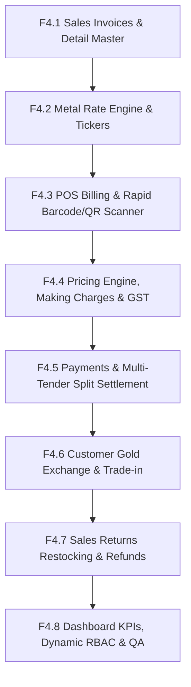

# 🏆 JMS Frontend — Phase 4 Sales, POS & Financial Settlement Subsystem

## Executive Overview

The **Phase 4 Frontend** for the Jewellery Management System (JMS) is a complete, enterprise-grade suite of Point of Sale (POS) billing, commercial sales invoicing, bullion metal rate management, dynamic making charges & GST pricing, customer gold exchanges, multi-tender payment settlements, sales returns with physical stock restoration, and statutory refunds.

It integrates seamlessly with the verified **Phase 4 JMS Backend (Sprints 4.1 → 4.8)** while strictly preserving all Phase 1–3 architecture, design tokens, dynamic RBAC permission boundaries, authentication, and layouts.

---

## 🏛 Frontend Architecture & Sprints



---

## 🚀 Phase 4 Sprint Summary & Deliverables

| Sprint | Module | Route | API Service | Required Permissions |
| :--- | :--- | :--- | :--- | :--- |
| **F4.1** | Sales Invoices | `/sales/invoices`<br>`/sales/invoices/:id` | `src/api/salesInvoices.ts` | `sales_invoice.read`<br>`sales_invoice.create`<br>`sales_invoice.update`<br>`sales_invoice.confirm`<br>`sales_invoice.cancel` |
| **F4.2** | Metal Rate Engine | `/masters/metal-rates` | `src/api/metalRates.ts` | `metal_rate.read`<br>`metal_rate.create`<br>`metal_rate.update` |
| **F4.3** | POS Cashier Terminal | `/sales/pos` | `src/api/salesInvoices.ts` (`/sales/pos/inventory/:identifier`) | `sales_invoice.read`<br>`sales_invoice.create`<br>`sales_invoice.confirm` |
| **F4.4** | Making Charges & GST | `/masters/making-charges`<br>`/masters/tax-rates` | `src/api/makingCharges.ts`<br>`src/api/taxRates.ts`<br>`src/api/pricing.ts` | `making_charge.read`<br>`making_charge.create`<br>`tax_rate.read`<br>`tax_rate.create` |
| **F4.5** | Payments & Settlement | `/sales/payments` | `src/api/salesPayments.ts` | `sales_payment.read`<br>`sales_payment.create`<br>`sales_payment.reverse` |
| **F4.6** | Gold Exchange / Trade-in | `/sales/gold-exchanges` | `src/api/goldExchanges.ts` | `gold_exchange.read`<br>`gold_exchange.create`<br>`gold_exchange.value`<br>`gold_exchange.apply`<br>`gold_exchange.cancel` |
| **F4.7** | Returns & Refunds | `/sales/returns`<br>`/sales/refunds` | `src/api/salesReturns.ts`<br>`src/api/salesRefunds.ts` | `sales_return.read`<br>`sales_return.create`<br>`sales_return.approve`<br>`sales_return.process`<br>`sales_refund.create`<br>`sales_refund.reverse` |
| **F4.8** | Integration & Dashboard | `/` (Dashboard) | All Phase 4 Services | Dynamic RBAC Guards |

---

## 💳 End-to-End Workflow Flowchart

```text
[LOGIN / ME] 
     ↓
[SELECT CUSTOMER & BRANCH] 
     ↓
[SCAN BARCODE / QR / ITEM CODE]
     ↓ (GET /api/v1/sales/pos/inventory/:identifier)
[ADD TO POS CART]
     ↓
[LOCK METAL RATE] (POST /sales/invoices/:id/lock-metal-rate)
     ↓
[CALCULATE AUTHORITATIVE PRICING] (POST /sales/invoices/:id/calculate-pricing)
     ↓
[OPTIONAL: OLD GOLD EXCHANGE] (POST /sales/invoices/:id/gold-exchanges -> value -> apply)
     ↓
[CONFIRM POS SALE] (POST /sales/invoices/:id/confirm -> Inventory AVAILABLE -> SOLD)
     ↓
[MULTI-TENDER SPLIT PAYMENT] (POST /sales/payments -> Cash/UPI/Card -> Settle to PAID)
     ↓
[RETURNS & RESTOCKING] (POST /sales/returns -> approve -> process -> SOLD -> AVAILABLE)
     ↓
[DISBURSE REFUND] (POST /sales/refunds -> completed)
```

---

## 🔒 Security & Dynamic Permission Architecture

The frontend adheres to strict dynamic permission checking through `hasPermission(permissionKey)` provided by `useAuth()`. Action buttons, navigation links, and lifecycle transition triggers render only if the authenticated user has the necessary backend permissions:

- **Sales Invoice**: `sales_invoice.create`, `sales_invoice.read`, `sales_invoice.update`, `sales_invoice.confirm`, `sales_invoice.cancel`
- **Metal Rates**: `metal_rate.create`, `metal_rate.read`, `metal_rate.update`
- **Making Charges**: `making_charge.create`, `making_charge.read`, `making_charge.update`
- **Tax Rates**: `tax_rate.create`, `tax_rate.read`, `tax_rate.update`
- **Payments**: `sales_payment.create`, `sales_payment.read`, `sales_payment.reverse`
- **Gold Exchange**: `gold_exchange.create`, `gold_exchange.read`, `gold_exchange.update`, `gold_exchange.value`, `gold_exchange.apply`, `gold_exchange.cancel`
- **Sales Return**: `sales_return.create`, `sales_return.read`, `sales_return.update`, `sales_return.approve`, `sales_return.process`, `sales_return.cancel`
- **Sales Refund**: `sales_refund.create`, `sales_refund.read`, `sales_refund.reverse`

---

## 🎨 Luxury Jewellery Design System Tokens

- **Warm Ivory Background**: `#F7F5F0`
- **Obsidian Black Accents**: `#0B0B0D`
- **Champagne Gold Primary**: `#C6A15B`
- **Platinum Secondary**: `#D7D9DC`
- **Emerald Success**: `#059669`
- **Ruby Reversals & Alerts**: `#DC2626`
- **Typography**: `Plus Jakarta Sans` for clean data readability, `Cinzel` for luxury brand typography.
